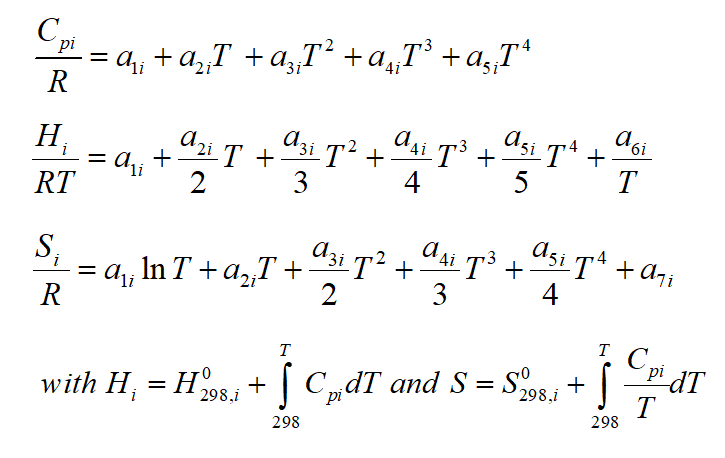
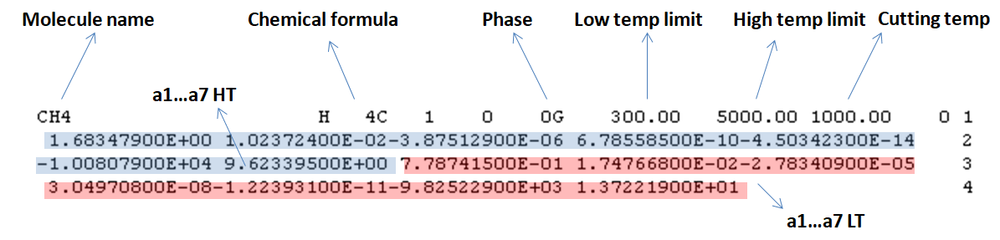
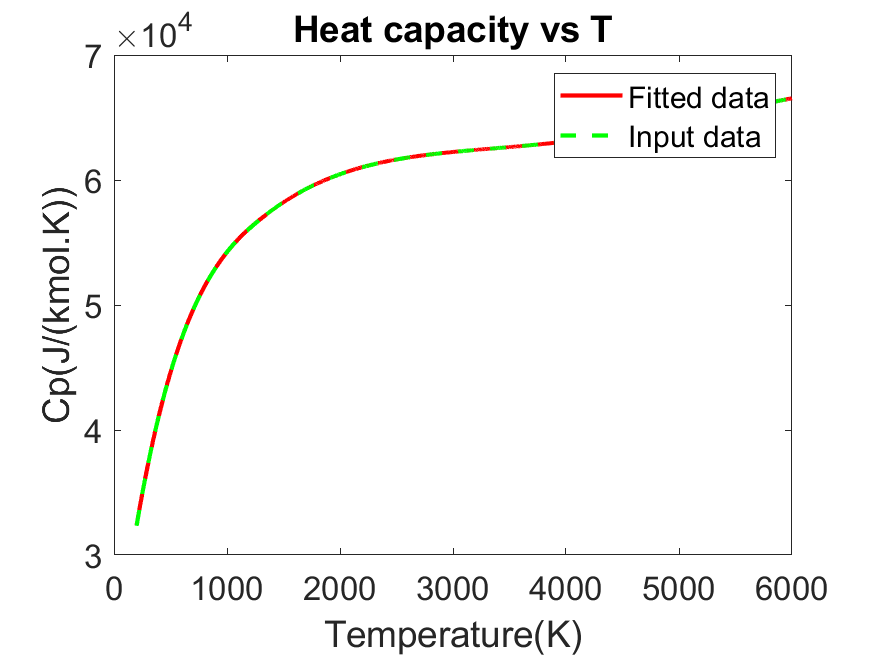

# JANAF thermochemical tables to NASA polynomials converter
These codes allows to generate [NASA Glenn Coefficients](https://ntrs.nasa.gov/api/citations/20020085330/downloads/20020085330.pdf) from JANAF (Joint Army-Navy-Air Force) [thermochemical tables](https://janaf.nist.gov/janaf4pdf.html) or any other thermochemical table formatted like the JANAF tables found on the [NIST Chemistry Notebook](https://webbook.nist.gov/chemistry/) or your own data found by ab-initio calculations for example. The text formatting of the NASA polynomials is rather strict and can found in some [old edition of the Chemkin manual](CHEMKIN_III_manual(1996).pdf).

## The NASA formalism for thermochemical data

H stands for enthalpy, S for entropy and Cp for heat capacity (R being the gas constant). The NASA formalism assumes that any set of thermochemical data can be fitted with a 4th order polynom. As H and S are functions of Cp and T, polynomial coefficients are common except for a6 (standard heat of formation at 298 K time R) and a7 (standard-state entropy at 298K times R). For better accuracy, the data are divided in two sets: loww and high temperature. The limit between the two is a free parameter to change in order to increase fitting accruracy (what does the code). Dividing all data by R avoids the mismatch between Calories and Joules units, which is a common source of error.

## The NASA formalism for text output

The text output must exactly follow this formalism to be red by Chemkin and codes using Chemkin as core for solving chemistry (like ANSYS Fluent or CFD-Ace for example).

The code is quite simple to use: provide a text file with T, H/(RT), Cp/R and S/R in columns and it will calculate the low temperature and high temperature polynomials, then format a text output compatible with NASA Glenn coefficients formalism. It also allows verifying this file integrity (or any other) and plotting the entropy, enthalpy and heat capacity as a function of temperature.

## Example of code output for carbon dioxide
    CO2               L 7/88C   1O   2    0    0G    200.00   6000.00 1350.00    0 1
    +4.62537358e+00+2.75453121e-03-1.00132575e-06+1.61339471e-10-9.22210240e-15    2
    -4.90178145e+04-1.86786957e+00+2.37883898e+00+8.89413299e-03-7.16523679e-06    3
    +2.85937031e-09-4.44677422e-13-4.83746410e+04+9.80192108e+00                   4

## Example of graphical output for carbon dioxide

This code was made for my own use at work, for juggling between thermochemical databases and Chemkin. I decline any responsibility in the event of a rocket launch failure or satellite crash on mars following the misuse of these codes.

