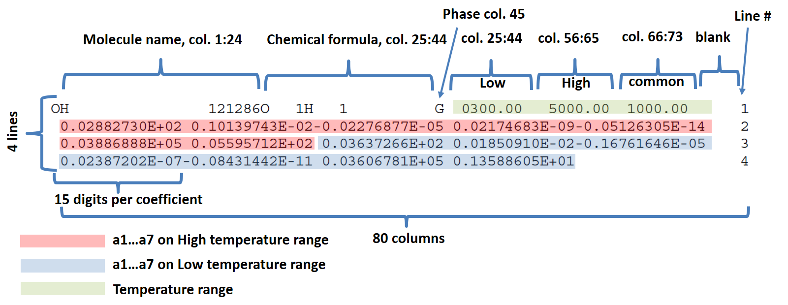
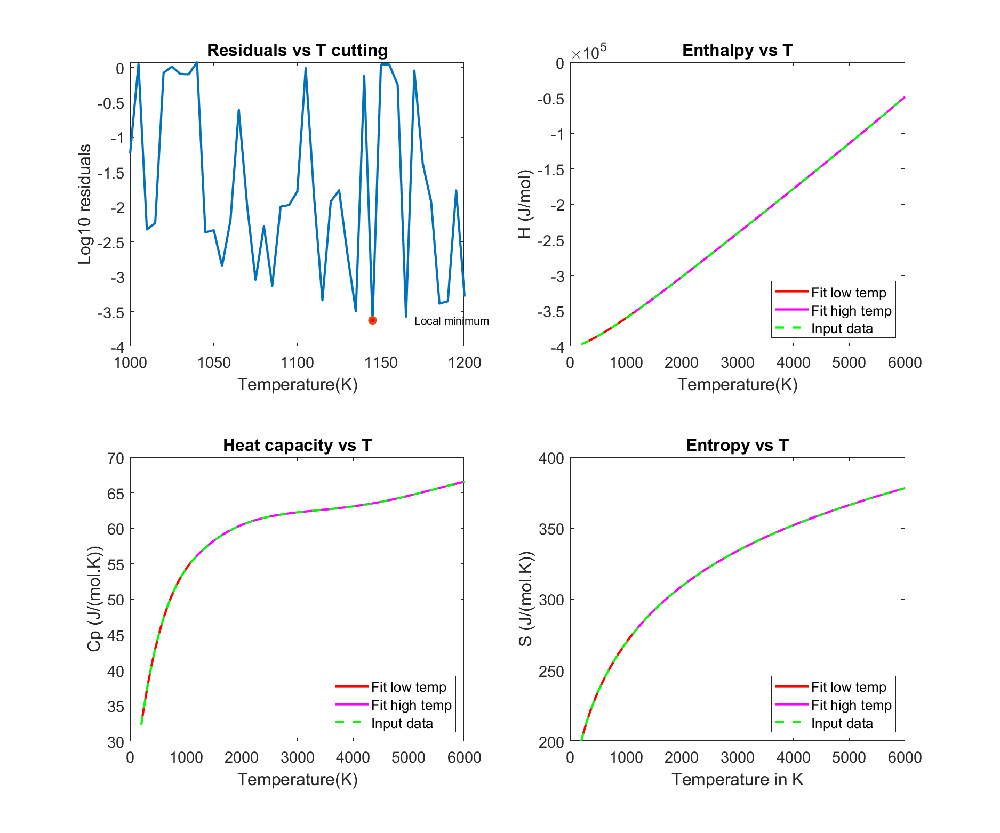

# A tool to convert JANAF thermochemical tables to NASA Glenn coefficients
These codes allows to generate [NASA Glenn Coefficients](https://ntrs.nasa.gov/api/citations/20020085330/downloads/20020085330.pdf) from JANAF (Joint Army-Navy-Air Force) [thermochemical tables](https://janaf.nist.gov/janaf4pdf.html) or any other thermochemical table formatted like the JANAF tables found on the [NIST Chemistry Notebook](https://webbook.nist.gov/chemistry/) or your own data found by ab-initio calculations for example. The text formatting of the NASA polynomials is rather strict and can found in some [old edition of the Chemkin manual](CHEMKIN_III_manual(1996).pdf). 

## Example of entry data: the [JANAF table for Carbon dioxide](https://janaf.nist.gov/pdf/JANAF-FourthEd-1998-Carbon.pdf)

The deal is to turn this ugly table into some fancy polynomials. Of course it has been made for many usual gases that are yet introduced into databases, but some remains under this form, and no luck, you could need them for your calculations.

## The NASA formalism for thermochemical data

H stands for enthalpy, S for entropy and Cp for heat capacity (R being the gas constant). H and S are always given relative to a reference state at 298 K and 1 bar.

The NASA formalism assumes that any set of thermochemical data on a large range of temperature can be fitted in chunks with 4th order polynoms. As H and S are functions of Cp and T, polynomial coefficients are common between them except for a6 (standard heat of formation at 298 K time R) and a7 (standard-state entropy at 298K times R). For better accuracy, the data are divided in two sets: low and high temperature. The limit between the two is a free parameter to change in order to increase fitting accruracy (what the code does). Dividing all data by R avoids the mismatch between Calories and Joules units, which is a common source of error, as there is less than an order of magnitude difference between them.

## The NASA formalism for text output

The text output must exactly follow this formalism to be red by Chemkin and codes using Chemkin as core for solving chemistry (like ANSYS Fluent or CFD-Ace for example).

The code is quite simple to use: provide a text file with T, H/(RT), Cp/R and S/R in columns and it will calculate the low temperature and high temperature polynomials, then format a text output compatible with NASA Glenn coefficients formalism. It also allows verifying this file integrity (or any other) and plotting the entropy, enthalpy and heat capacity as a function of temperature.

In details, the code first search for the best temperature limit between low and high temperature to minimize residuals with the two polynomials, then performs a final fitting with a fixed optimal limit. Minimization of residuals between data and polynomials is performed with a simple Nelder-Mead algorithm as this is not a particularly wicked problem. At the junction between polynomials, the code forces continuity of slopes and values of Cp. As Cp is then integrated to obtain H and S, slope continuity with Cp ensures slope continuity with its integrals. I'm not that sure Cp slope continuity is a mandatory condition regarding NASA standards but I heard it was years ago from people having a past working experience at NASA in the 90's. It's in fact not that difficult to code. Finally, the code formats data to comply with NASA Glenn Coefficients shape. It generates a text output on Matlab prompt, a formatted file and some fancy outputs to verify than everything gone smoothly during optimization.

## Example of code output for carbon dioxide
    CO2               L 7/88C   1O   2    0    0G    200.00   6000.00 1350.00    0 1
    +4.62537358e+00+2.75453121e-03-1.00132575e-06+1.61339471e-10-9.22210240e-15    2
    -4.90178145e+04-1.86786957e+00+2.37883898e+00+8.89413299e-03-7.16523679e-06    3
    +2.85937031e-09-4.44677422e-13-4.83746410e+04+9.80192108e+00                   4

## Example of fancy graphical output for carbon dioxide

## Warning
This code was made for my own use at work, for juggling between thermochemical databases and Chemkin. I decline any responsibility in the event of a rocket launch failure or a satellite crash on Mars following the misuse of these codes.

